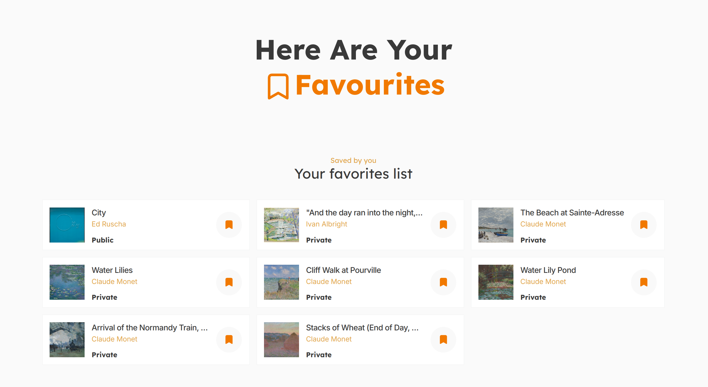

# [Modsen Art Museum](https://modsen-art-museum-three.vercel.app/)

Welcome to my solution of Modsen test case, dedicated to the creation of the art museum with the help of [external API](https://api.artic.edu/docs/#quick-start).

## Functionality

### Minimal:

- External API usage (_for centralized management of the API, I've created a class located in `src/utils/ApiController.ts`_);
- Pagination (_also I used debouncer here. Useful when the user runs through pages blazingly fast_);
- Search with input validation and debouncer (_I additionally check the max lenght of the text and trim it_);
- Routing (_for which I've used `react-router-dom`_);
- Saving favorite pages to a special page with the help of local storage (_check the [chapter](#favorites-page-fav)_);
- View of detail info of the artworks;
- Sorting of the artworks on the main page (_Check the [chapter](#main-page-)_);
- React Context (_check the [chapter](#favorites-page-fav)_)

### Additional:

- Responsive design with burger menu for small devices;
- Loaders (_blinking panels, check the [media section](#media)_);
- **Typescript** usage;
- **Zod** usage for validating the data of the external API;
- **Jest** testing (_covered both rendering and sometimes logic, but jest is absolutely afwul when it comes to TS and the logic that is a bit more complex than 2\*2, tbf..._);
- **React Query** usage (_for the advanced fetching state managing and API data caching_);
- Usage of the [suggested folder structure](https://github.com/mkrivel/structure);
- **ESlint, Prettier and Husky** configured;
- **GitFlow** usage (_the amount of branches went crazy_);
- **Styled components** library for styling;

## A bit about the pages

### Main page (/)

So on the matter of the sorting - I offer four types of sorting:

1. By date (asc);
2. By date (desc);
3. By title (asc);
4. By title (desc);

But you sort only within one page, which is a great feature (and the external API guys just didn't really provide with this option on their side, and I don't want to lie to the user by doing some shenanigans with fetching more pages than needed and then sorting them god knows how).

### Artwork page (/artwork/:id)

The great point here is that I don't always to a fetch req to the external API servers. If the user comes from the main page, I just show more detailed data, that was fetched for the main page.

Fetch happens when there's no data cached (i.e. the user just randomly opened the link to the artwork page).

This ended up as a great performance improvement.

### Favorites page (/fav)

For this page, I had to use local storage, which implied that i need to save some data of the favourite pictures to somehow show it later. There were two possible ways:

1. Save all the data of the picture, so later i just show it.
2. Save IDs of the artworks so i fetch and then show them.

The first way seemed kinda appealing due to the fact I won't need to fetch the data when the user opens the page... though that's not really true. Well, for some time after creating the record - yea, you just show the data, but then a lot of questions rise, and all are dedicated to the data validation. The external API has a right to change the info about any artwork anytime, so I need to invalidate my stash. How do you know the data is outdated? You need to fetch and compare or just replace. So that doesn't really help and just brings more problems.

So I've chosen the second path. Easy to verify, to validate.

And every page of the web app has a way to save the pic to or remove from the favourites list, so I wrapped the whole app with a context that provided me with functions that allowed me to access the local storage's validated and checked data. Later i can use that data (that is saved IDs) for fetching and other funsies of webdev.

Also from this page one can centralized remove the artworks from their favs. In case the click was erroneous, I don't remove the artwork from the page until it reloaded - it's just the bookmark that becomes empty again.

## Build and testing

For development, use:

```bash
  yarn install
  yarn run dev
```

For building:

```bash
  yarn build
  yarn preview
```

To test:

```bash
  yarn test
```

This will also print coverage as a last thing to your console. Currently I have the following values, which correspond to requested 30% of coverage in the test case description:

| File      | % Stmts | % Funcs | % Lines |
| --------- | ------- | ------- | ------- |
| All files | 35.88   | 31.73   | 37.77   |

## Media





